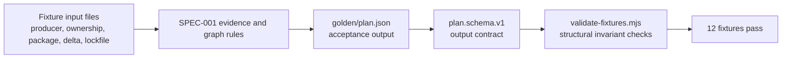

<!-- Generated by sourcery-ai[bot]: start review_guide -->

## Reviewer's Guide

This PR establishes a pre-implementation V0 acceptance corpus and its contracts: 12 sanitized input/golden scenarios encode evidence-aware planning, uncertainty, publication and ownership boundaries, graph traversal, and cycle refusal; accompanying schemas, manifest invariants, and a structural validator make the expected output shape reviewable before implementation.

#### Flow diagram for fixture inputs to validated V0 plans

### File-Level Changes

| Change | Details | Files |
| ------ | ------- | ----- |
| Adds the first acceptance-fixture corpus for the V0 planner, covering producer evidence, ownership boundaries, missing and conflicting evidence, lockfile traversal, package-management formats, publication gating, and cycle refusal. | <ul><li>Adds 12 input/golden fixture pairs with explicit three-state classifications, evidence gaps, wave prerequisites, and refusal behavior.</li><li>Documents each fixture’s intended assertions and corpus-wide invariants in the manifest.</li></ul> | `fixtures/F1-eight-package-producer/**` `fixtures/F1b-independent-versioning/**` `fixtures/F2-outside-team-producer/**` `fixtures/F3a-no-producer-evidence/**` `fixtures/F3b-conflicting-producers/**` `fixtures/F4a-transitive-lockfile/**` `fixtures/F4b-transitive-no-lockfile/**` `fixtures/F5-third-party-via-internal/**` `fixtures/F6-packages-config/**` `fixtures/F7-cpm-override/**` `fixtures/F8-partial-publication/**` `fixtures/F-cyc-cycle-refusal/**` `fixtures/MANIFEST.md` |
| Defines the fixture input shapes and introduces the plan.v1 output schema for validating acceptance goldens. | <ul><li>Pins five sanitized input formats and explicitly documents unknown semantics for omitted publication, ownership, and lockfile child details.</li><li>Adds the JSON Schema 2020-12 output contract used by all golden plans.</li><li>Records the unresolved real tracemap consumer-fact export schema as a known issue.</li></ul> | `docs/schemas/input-schemas.md` `docs/schemas/plan.schema.v1.json` `docs/specs/SPEC-001-evidence-and-graph-model.md` |
| Adds an authoring-time structural validator for the fixture corpus. | <ul><li>Checks required plan fields, enum values, reasons, three-state classifications, wave status prerequisites, release-unit basis, uncertainty arrays, and cycle-stop shape.</li><li>Scans all fixture directories and reports per-fixture failures with a nonzero exit status.</li></ul> | `tools/validate-fixtures.mjs` |

---

Tips and commands

#### Interacting with Sourcery

- **Trigger a new review:** Comment `@sourcery-ai review` on the pull request.
- **Continue discussions:** Reply directly to Sourcery's review comments.
- **Generate a GitHub issue from a review comment:** Ask Sourcery to create an
  issue from a review comment by replying to it. You can also reply to a
  review comment with `@sourcery-ai issue` to create an issue from it.
- **Generate a pull request title:** Write `@sourcery-ai` anywhere in the pull
  request title to generate a title at any time. You can also comment
  `@sourcery-ai title` on the pull request to (re-)generate the title at any time.
- **Generate a pull request summary:** Write `@sourcery-ai summary` anywhere in
  the pull request body to generate a PR summary at any time exactly where you
  want it. You can also comment `@sourcery-ai summary` on the pull request to
  (re-)generate the summary at any time.
- **Generate reviewer's guide:** Comment `@sourcery-ai guide` on the pull
  request to (re-)generate the reviewer's guide at any time.
- **Resolve all Sourcery comments:** Comment `@sourcery-ai resolve` on the
  pull request to resolve all Sourcery comments. Useful if you've already
  addressed all the comments and don't want to see them anymore.
- **Dismiss all Sourcery reviews:** Comment `@sourcery-ai dismiss` on the pull
  request to dismiss all existing Sourcery reviews. Especially useful if you
  want to start fresh with a new review - don't forget to comment
  `@sourcery-ai review` to trigger a new review!

#### Customizing Your Experience

Access your [dashboard](https://app.sourcery.ai) to:
- Enable or disable review features such as the Sourcery-generated pull request
  summary, the reviewer's guide, and others.
- Change the review language.
- Add, remove or edit custom review instructions.
- Adjust other review settings.

#### Getting Help

- [Contact our support team](mailto:support@sourcery.ai) for questions or feedback.
- Visit our [documentation](https://docs.sourcery.ai) for detailed guides and information.
- Keep in touch with the Sourcery team by following us on [X/Twitter](https://x.com/SourceryAI), [LinkedIn](https://www.linkedin.com/company/sourcery-ai/) or [GitHub](https://github.com/sourcery-ai).

<!-- Generated by sourcery-ai[bot]: end review_guide -->
